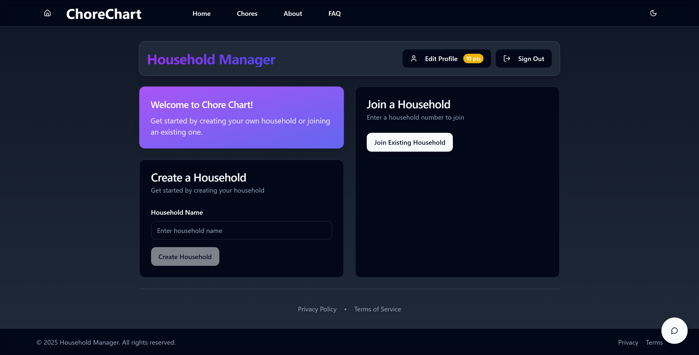
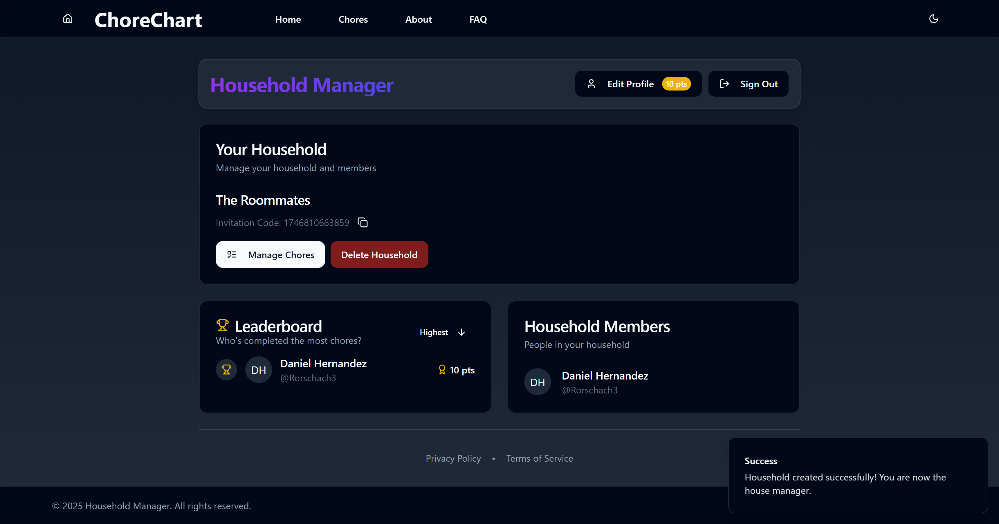
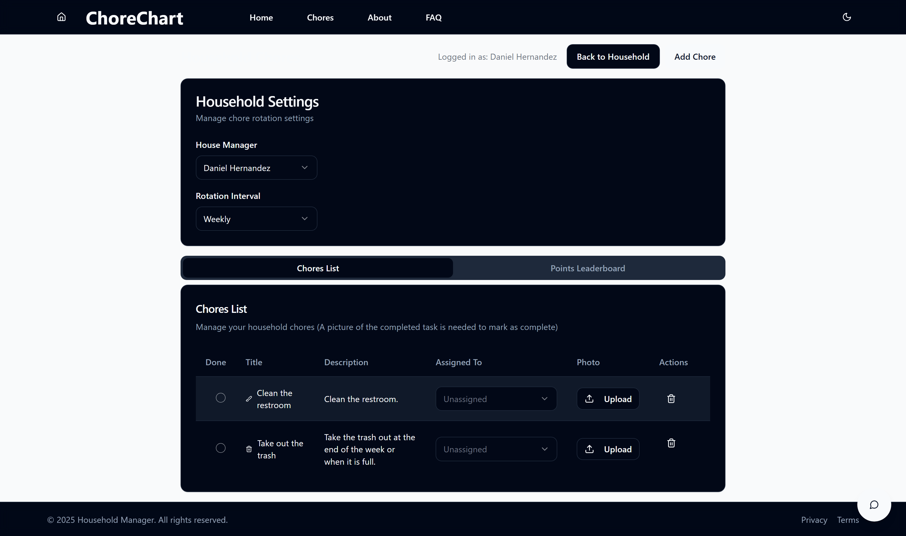

#  ChoreChart


**ChoreChart** is a modern solution designed to help roommates manage and distribute household chores fairly and efficiently. Our automated system takes the hassle out of chore management, making shared living spaces more harmonious.

Whether you're living with one roommate or several, ChoreChart helps you:

-  Automatically distribute chores fairly among household members  
-  Track completion of tasks with photo verification  
-  Maintain a clear schedule of responsibilities  
-  Avoid conflicts over household duties  
-  Keep your shared space clean and organized
-  AI Chatbot to help users with any questions or issues

---

##  Screenshots

| Dashboard | Chore Assignment | Photo Verification |
|----------|------------------|--------------------|
|  |  |  |

---

##  Getting Started

> **Requirements:**  
> Make sure you have [Node.js](https://nodejs.org/en/) and [npm](https://www.npmjs.com/) installed. We recommend using [nvm](https://github.com/nvm-sh/nvm) to manage Node versions.

### Installation Steps

```bash
# Step 1: Clone the repository
git clone https://github.com/Rorschach3/chore-chart.git

# Step 2: Navigate to the project folder
cd chore-chart

# Step 3: Install dependencies
npm install

# Step 4: Run the development server
npm run dev
````

---

## 🛠 Technologies Used

*  [Vite](https://vitejs.dev/)
*  [TypeScript](https://www.typescriptlang.org/)
* ⚛ [React](https://react.dev/)
*  [shadcn/ui](https://ui.shadcn.com/)
*  [Tailwind CSS](https://tailwindcss.com/)

---

## ✏ Editing Options

###  Edit Directly in GitHub

1. Navigate to the desired file.
2. Click the **pencil icon** (Edit).
3. Make your changes and commit them.
---

## ❓ Frequently Asked Questions

### How does ChoreChart work?

ChoreChart uses an automated system to distribute chores fairly. You can assign tasks, verify completion with photos, and ensure everyone does their part.

### How do I create a household?

You'll be guided through household setup upon signing in. Add members, set preferences, and start assigning tasks.

### Why do I need to upload photos of completed chores?

Photo verification keeps everyone accountable and helps avoid disputes.

### Can I customize chore schedules?

Yes! You can assign specific days, frequencies, and task types per person.

### How is the chore distribution kept fair?

ChoreChart rotates assignments based on load, past completions, and user preferences to ensure equity.

---

## 🧠 Contributing

Pull requests are welcome! If you have improvements or bug fixes, please fork the repo and submit a PR.

---

## 📄 License

This project is licensed under the MIT License. See the [LICENSE](./LICENSE) file for details.
